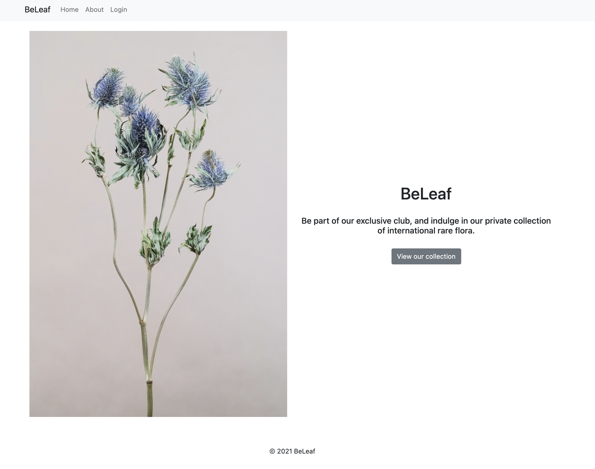

# **Beleaf**

### Deployed application: [Beleaf](https://beleaf-rails.herokuapp.com/)

 <br>
 
 ### Github repo: [Beleaf](https://github.com/arturo-caceres/ArturoCaceres_T2A2)

 <hr>

<br>

## **Identification of the problem you are trying to solve.**

People enjoy working and living in cultivated greenspaces. Studies have shown that there are multiple benefits of having/caring for plants. Between them, they have found out, that plants help reduce stress levels, real plants sharpen the attention of people, working with plants can be therapeutic, plants may help people recover from illness faster, they boost productivity, and they improve the quality of indoor air. There are more benefits, but I just wanted to make a note of how they can help in our day-to-day; especially since 2007, as there has been a massive interest in acquiring plants.

In 2020, Australia spent $2.6 billion on more than 1.7 billion plants due to Covid-19 lockdowns. After joining toilet paper and pasta on the list of panic-buying items at the start of the pandemic, sales of herbs and plants shot up 27 per cent. More broadly, sales from production nurseries into retail garden centres grew 10 per cent, according to new figures from the Nursery Industry Statistics survey.

As a personal hobby, collecting and buying plants it’s a passion and it’s something I enjoy thoroughly. I particularly have an interest in getting my hands on peculiar plants, but the problem is that I have to visit different nurseries or go to the sales they do on warehouses to try to find something I might like. Usually, those places don't show pictures of their variety of plants, so sometimes I might travel for over an hour and there might be a high chance I would find nothing that picks up my interest. The main problem is that a site that sells more exclusive or peculiar plants, doesn’t exist.

<br>

## **Why is it a problem that needs solving?**

By creating a site that sells more exclusive and rare flora facilitates people from moving around and wasting their money and time. Users could also sell their own plants, as it is common that a hobby might turn into a business in the long run. This would also be beneficial for small businesses, as they can also get a chance to sell their products on par with the big companies. By just checking online from the users’ phone or computer, they can acquire an atypical plant.

<br>

# **Application Description**

## **Purpose**

The purpose of this project is to create a platform for the plant community(buyers and sellers), who are interested in acquiring rare/atypical plants.

<hr>

## **Functionality/Features**

### - User Sign up and Log in:

Sign-up forms allow customers to 'sign up' to receive more information about your business and stay up-to-date on your company's latest products and services. Beleaf, allows user to create an account with their own personal email address; as this is a security measure design to prevent unauthorized access to confidential data. When logged in, users will be able to interact with the sites features.

### - Authentication:

By not having a secure authentication system, the site is potentially exposing the users to identity theft or fraud. For the user to have the ability to buy or sell plants, they must authenticate, as it is restricted to those with an account. Authentication is also important for tracking user interactions with the application and have information relating to a user should any issue might arise.

### - Authorization:

Authorization is about deciding whether an individual is permitted to perform a given action on a specific resource. When dealing with access to any sort of sensitive data assets, both authentication and authorization are required. A seller won't be able to sell plants of other clients or buy for other clients.

### - Plant CRUD

Users will have to ability to Create, Read, Update and Delete plants, as it is the main feature of this application. Without the ability to manipulate the mentioned before, there is no reason for users to use this platform for buying or selling plants.

### - Plant Searching

For a better experience to the users, searching for an item has been implemented. This feature will allow the user to find a plant without having to scroll through all plants.

### - Image Upload

Users will have the ability to upload images of the plants they are interested in selling, this way, buyer will be aware what are they buying. Images will be uploaded to server and displayed with detailed information of a plant.

### - Plant Pricing

Users will decide how muche their plants will be selling for. Beleaf will recolect a percentage of that transaction due to using the platform as a selling media.

### - Plant Stock

When a user has bought a plant, this will still show in the collection of plants, but will say "Out of stock", making other insterested users known there are plants coming up.

### - Plant Dashboard

User will be able to manage everything through their dashboard. Users will see the plants they are selling, the plants they bought and also the available plants in the collection.

<hr>

## **Sitemap**


<hr>

## **Screenshots**

- Landing page view



- About view


- Log in view


- Sign up view


- Dashboard view


- Adding a new plant


- Plant description


- Editing user account


<hr>

## **Target Audience**

For this application, the target audience is mainly users who are interested in acquiring or selling rare specimens of flora. Users understand that as plants are rare and difficult to find, hence they can be of a very high value.

<hr>

## **Tech Stack**

```Ruby
- Project Managment
    Trello

-Version Control
    Github

- Database
    PostgreSQL

- Deployment Cloud Platform
    Heroku

- Image Cloud Platform
    Amazon Web Services (AWS)

- CSS Framework
    Bootstrap

- Flowchart Solution
    Draw.io

- Wireframes
    Balsamiq

- Language
    Ruby "2.6.6"

- Gems
    gem "rails" "6.1.3", ">= 6.1.3.2"
    gem "pg" "1.1"
    gem "puma" "5.0"
    gem "sass-rails" ">= 6"
    gem "webpacker", "5.0"
    gem "jbuilder", "2.7"
    gem "bootstrap", "5.0", ">= 5.0.1"
    gem "jquery-rails"
    gem "devise", "4.2"
    gem "image_processing" 1.2
    gem "bootsnap", >= 1.4.4
    gem "byebug", platforms: [:mri, :mingw, :x64_mingw]
    gem "web-console", ">= 4.1.0"
    gem "rack-mini-profiler", "2.0"
    gem "listen", "3.3"
    gem "tzinfo-data", platforms: [:mingw, :mswin, :x64_mingw, :jruby]
    gem "aws-sdk-s3", "1.95"
```

<hr>

## **User Stories**


<hr>

## **Wireframes**

Wireframes were created with balsamiq.


<hr>

## **Detail any third party services that your app will use**

Trello: is a collaboration tool that organizes your projects into boards. In one glance, Trello tells you what's being worked on, who's working on what, and where something is in a process. Imagine a white board, filled with lists of sticky notes, with each note as a task for you and your team.

Github: is a code hosting platform for version control and collaboration. It lets you and others work together on projects from anywhere.

PostgreSQL: is an open-source relational database management system emphasizing extensibility and SQL compliance.

Heroku: is a container-based cloud Platform as a Service (PaaS). Developers use Heroku to deploy, manage, and scale modern apps.

Amazon Web Services (AWS): is a secure cloud services platform, offering compute power, database storage, content delivery and other functionality to help businesses scale and grow.

Bootstrap: is a potent front-end framework used to create modern websites and web apps. It's open-source and free to use, yet features numerous HTML and CSS templates for UI interface elements such as buttons and forms.

Draw io: is a flowchart solution designed to help developers, network admins, IT analysts, and designers use drag-and-drop functionality to create and publish diagrams.

Balsamiq: is a user interface design tool for creating wireframes (sometimes called mockups or low-fidelity prototypes). You can use it to generate digital sketches of your idea or concept for an application or website, to facilitate discussion and understanding before any code is written.

<hr>

## **ERD & Schema database design**


<hr>

## **Beleaf Associations**

An association is a connection between two Active Record models and we need them because they make common operations simpler and easier on the code.

### User Model

Devise
Is a flexible authentication solution for Rails based on Warden as it is a complete MVC solution based on Rails engines. It allows you to creates sign-up and sign-in forms, it also can be used to create user accounts for privacy to have multiple roles (or models/scopes) signed in at the same time.

```Ruby
has_many :plants
```

A user can have many plants that they can buy or sell. To be able to create, edit and delete plants, is restricted to a specific user.

```Ruby
has_many :bought_plants, class_name: "Plant", foreign_key: :buyer_id
```

Within the user model, a user is able to buy plants, specifically from the class Plant. It also used to to keep track of the plants the user has or is willing to sell.

```Ruby
has_one_attached :image
```

When the user is creating a new plant, they are able to link an uploaded image with the information related to it. This way, the buyer is able to see the information avaible, matches the image.

### Plant Model

```Ruby
belongs_to :user**
```

Each and every plant must have an associated user to be able to be created, and thus a plant belongs to a User. Without a user to reference, the plant would not have details for where or how to sell a plant.

```Ruby
belongs_to :buyer, class_name: "User", optional: true
```

A plant belongs to a a buyer, referencing the class user. The user can create a plant, without having to have a buyer id, as the user might just be interetes in only selling and not buying a plant.

```Ruby
  has_one_attached :image
```

When the user is creating a new plant, the user will be able to link an uploaded image with the plant. This way, the buyer is able to see the name of the plant, matches with the image.

<hr>

## **The way tasks are allocated and tracked**

[Trello Board](https://trello.com/b/IXkwNHWm/beleaf%F0%9F%8D%83)

Trello was used to manage the project and it was distributed with features, ideaS, 2 types of requiremensts and rubrics. There were a couple of ideas as a lot of content wanted to be included on this application, that would have required more time. Tasks were created as cards, and moved from backlog, th to do, then in progress and when the card was completed, moved to done.

<hr>

## **Upcoming Beleaf 2.0**

Part of the original idea for this project, was also that a user would be able to have access to **"Beleaf on second chances"**, a plant hospital for plants. Many people will get a plant, and has no clue on how to take care after it, and will not take in cosideration all the conditions a plant needs, for it to keep living.

As being rare plants bought from this website, there are international flora coming from other countries. Some countries have diffferent weather and conditions that help that specific plant to grow and blossom. With the plant hospital option, a user would be able to pay for the proper set up of the plant, with instructions on how to care care of it and also pay for a continious care for the plant for a certain period of time. Users would also be able to pay for services with plants of their own, by uploading their pictures and descriptions of a plant in the hopes of saving it from dying. For the meantime, improving the current page and making it more user friendly is crucial.
